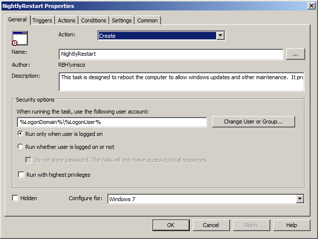
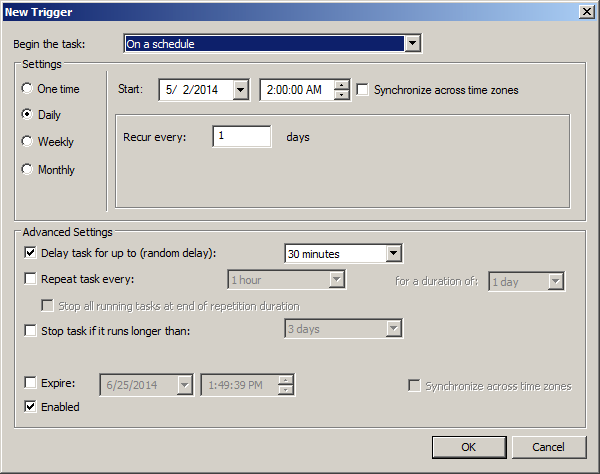
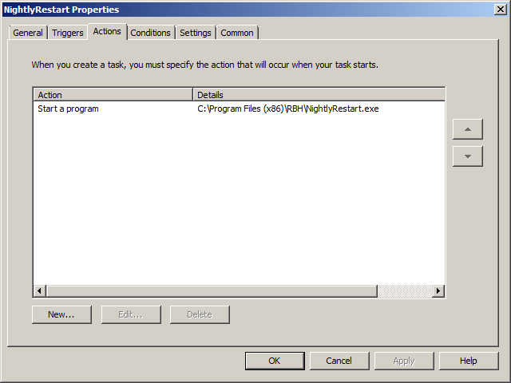

NightlyRestart
=======================

NightlyRestart is a simple compiled Powershell script to make reboots of user computers less intrusive.  My company wanted to restart any logged in computers at 2 AM so that we could perform maintenance tasks (installing software, patches, etc).  However, if a user was still working at 2 AM, we wanted to give them the opportunity to cancel the reboot and continue working.

Here's a quick video demonstrating how it works:

http://www.youtube.com/embed/BnXVGLc20W0?vq=hd720;

Basically the script first triggers a reboot operation using the built-in Windows 7 shutdown command.  It then pops up a window with an OK button.  If the user click on that OK button, the script cancels the reboot operation.

###Compiling Powershell
The EXE is created by compiling the Powershell script using PowerGUI.  You could configure the scheduled task to run the powershell script directly, but then you'd have to adjust the computer's Powershell security requirements.  By using an EXE, you don't need to change the security requirements.

[Download PowerGUI](http://en.community.dell.com/techcenter/powergui/m/)

###Installation
The system is easy to install using Group Policy Preferences.  Use a group policy preference to copy the file to the user's computer, then setup a scheduled task as follows:

